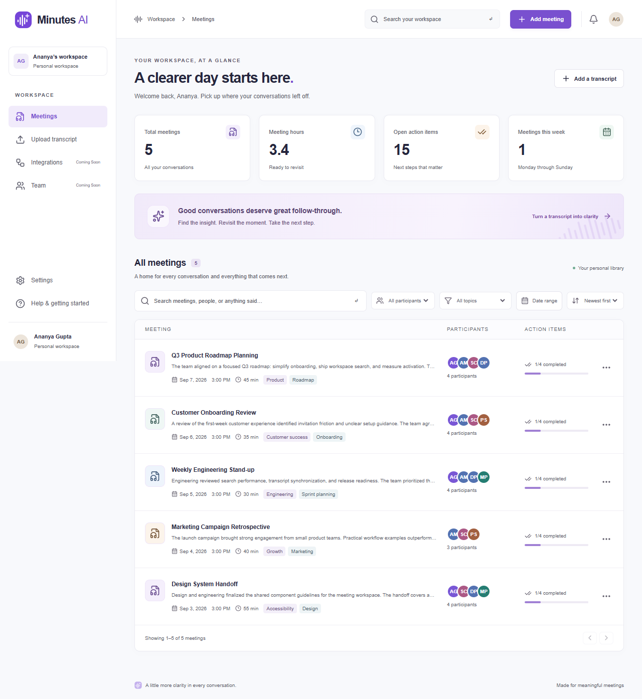
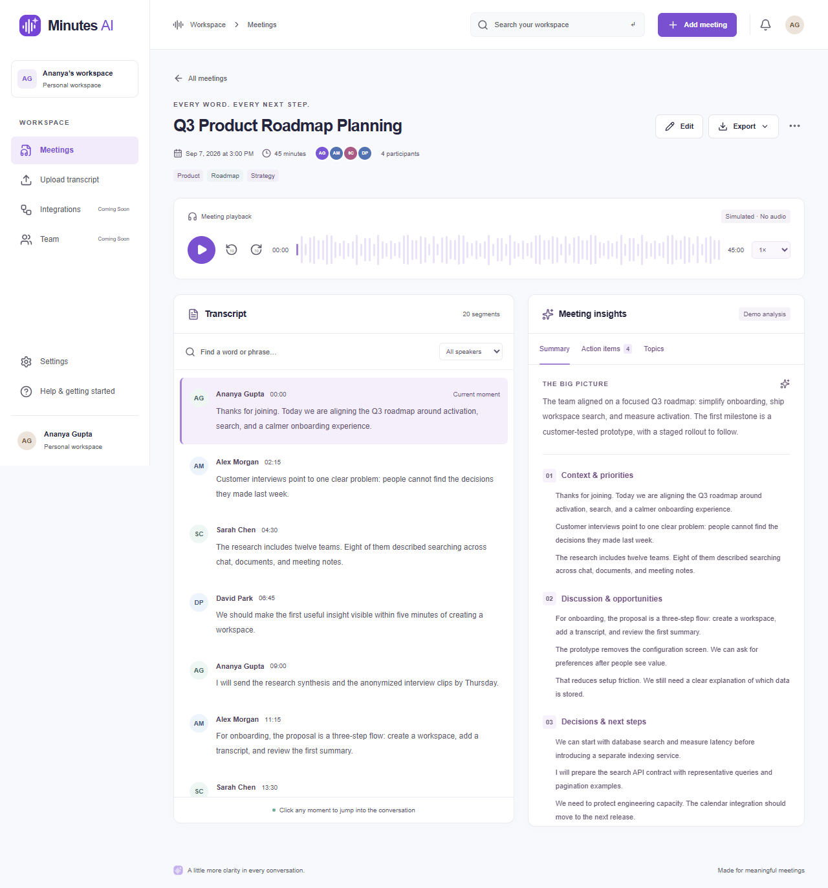
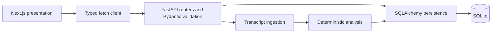
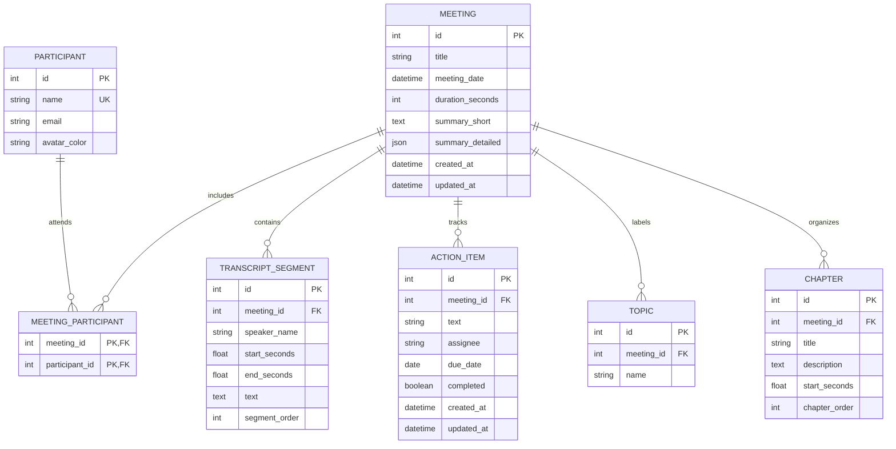

# Minutes AI

**Your meetings, made meaningful.**

Minutes AI is an original Fireflies.ai-inspired post-meeting intelligence platform. It turns text transcripts into a searchable meeting library, interactive conversation timelines, structured notes, chapters, and editable follow-ups. The purple waveform-and-spark icon, interface, and code were created for this project; no Fireflies logo, proprietary assets, or source code are included.

**Live demo:** Not deployed yet — add the Vercel URL after deployment.  
**Repository:** Add your repository URL after pushing this workspace.  
**Local application:** http://localhost:3000  
**Interactive API documentation:** http://localhost:8000/docs

## Screenshots

Captured from the running application by the browser smoke tests:





[Mobile meeting library](docs/screenshots/library-mobile.png) · [Mobile transcript workspace](docs/screenshots/detail-mobile.png)

## Features

- Meeting library with workspace-wide search across titles, participant names, transcript text, and topics.
- Participant, topic, and inclusive UTC date-range filters; newest/oldest/title sorting; pagination; shareable URL query state.
- Global meeting counts, hours, open tasks, and meetings in the current UTC calendar week.
- Meeting creation from pasted text or UTF-8 `.txt`, `.vtt`, and `.json` files; metadata editing; confirmation-based deletion.
- Simulated media player with play/pause, seek, skip ±10 seconds, and 0.75×–2× playback speed.
- Time-derived active transcript segment, automatic transcript-panel scrolling during playback, clickable speaker turns, and chapter navigation.
- Case-insensitive transcript search with safe highlighting of every occurrence, matching-segment count, wraparound next/previous navigation, and speaker filtering.
- Deterministic overview, sectioned notes, decisions, topics, chapters, and suggested action items.
- Persistent action-item creation, editing, completion, deletion, assignees, and due dates.
- Transcript TXT and meeting-notes Markdown downloads.
- Five realistic demo meetings, each with 20 transcript segments, four chapters, multiple speakers, four follow-ups, and mixed completion states.
- Responsive desktop sidebar/mobile navigation, keyboard-accessible dialogs and tabs, visible focus states, loading skeletons, empty/error states, and toast feedback.
- Clearly marked placeholders for integrations, team collaboration, live meeting capture, and profile settings; supported-format help page.

## Stack and architecture

| Layer | Technology |
| --- | --- |
| Frontend | Next.js 16 App Router, React 19, strict TypeScript |
| Presentation | Tailwind CSS 4, original CSS design system, Lucide React, Sonner |
| Forms | Native semantic forms and browser validation, typed payloads, authoritative Pydantic validation |
| Backend | Python 3.14, FastAPI, Pydantic, SQLAlchemy 2 |
| Database | SQLite, foreign-key enforcement, WAL mode |
| Testing | Pytest/FastAPI TestClient, Playwright with desktop Chrome and mobile Chrome emulation |
| Deployment | Vercel frontend; Docker-based Render backend with persistent disk |



The browser calls the backend directly using `NEXT_PUBLIC_API_URL`. No frontend mock database or localStorage fallback hides backend failures. All meeting and task mutations commit to SQLite before a success toast. Task checkboxes update optimistically and roll back if saving fails. Listing responses omit transcript segments; details include the complete transcript and chapters. Global statistics and filter options are independent of the current search results.

Real transcription is intentionally mocked: this application accepts existing text transcripts and does not transcribe audio. Playback advances application time without playing audio. Analysis uses deterministic text extraction, not a remote LLM. The architecture separates **transcript ingestion, analysis, persistence, and presentation**, so real speech-to-text or LLM services can be added later without replacing the workspace UI.

## Project structure

```text
Minutes AI/
├── AGENTS.md                     # Persistent Minutes AI naming conventions
├── README.md
├── render.yaml                   # Backend + persistent disk blueprint
├── docs/screenshots/             # Real desktop/mobile screenshots
├── backend/
│   ├── app/
│   │   ├── main.py               # App lifecycle and environment-driven CORS
│   │   ├── database.py           # Engine, sessions, SQLite pragmas
│   │   ├── models.py             # Normalized relationships and constraints
│   │   ├── schemas.py            # Input and response models
│   │   ├── routers.py            # HTTP CRUD/search endpoints
│   │   ├── seed.py               # Idempotent demo initialization
│   │   └── services/
│   │       ├── ingestion.py      # TXT, VTT, JSON parsing and validation
│   │       ├── analysis.py       # Replaceable deterministic analyzer
│   │       └── meetings.py       # Meeting creation orchestration
│   ├── tests/test_api.py
│   ├── Dockerfile
│   ├── .env.example
│   ├── .python-version
│   ├── requirements.txt
│   └── requirements.lock.txt
└── frontend/
    ├── src/app/                  # App Router routes, original icon, styles
    ├── src/components/           # Library, forms, player, transcript, insights
    ├── src/hooks/                # Reusable useMeetingPlayer hook
    ├── src/lib/                  # API client, shared types, exports, utilities
    ├── tests/workspace.spec.ts
    ├── playwright.config.ts
    ├── .env.example
    ├── package-lock.json
    └── vercel.json
```

## Local setup

Use **Node.js 24 LTS** and **Python 3.14** (the versions used for local verification). Next.js requires Node 20.9 or newer. Install Google Chrome to run the supplied browser tests.

From the repository root, in **PowerShell terminal 1**:

```powershell
cd backend
python -m venv .venv
.\.venv\Scripts\python.exe -m pip install -r requirements.txt -c requirements.lock.txt
Copy-Item .env.example .env
.\.venv\Scripts\python.exe -m uvicorn app.main:app --reload --host 127.0.0.1 --port 8000
```

In **PowerShell terminal 2**, starting at the repository root:

```powershell
cd frontend
npm ci
Copy-Item .env.example .env.local
npm run dev
```

Open **http://localhost:3000**. The root route redirects to `/meetings`. The API creates its tables and seeds the demo data on startup. Use `Copy-Item` only during first-time setup; preserve any customized environment files on subsequent runs.

On macOS/Linux, the equivalent backend setup is:

```bash
cd backend
python3.14 -m venv .venv
.venv/bin/python -m pip install -r requirements.txt -c requirements.lock.txt
cp .env.example .env
.venv/bin/python -m uvicorn app.main:app --reload --host 127.0.0.1 --port 8000
```

For the frontend use `cp .env.example .env.local` instead of `Copy-Item`, then `npm ci` and `npm run dev`.

### Production mode locally

With the API running, stop the frontend development server, then:

```powershell
cd frontend
npm run build
npm run start
```

### Environment variables

| Variable | Location | Default/example | Purpose |
| --- | --- | --- | --- |
| `NEXT_PUBLIC_API_URL` | `frontend/.env.local` or Vercel | `http://localhost:8000/api` | Full API base URL, **including `/api`**; compiled into the browser bundle |
| `DATABASE_URL` | `backend/.env` or hosting service | `sqlite:///./minutes_ai.db` | Local database relative to backend working directory |
| `DATABASE_URL` (production) | Render | `sqlite:////data/minutes_ai.db` | Database on the persistent mount |
| `CORS_ORIGINS` | Backend | `http://localhost:3000,http://127.0.0.1:3000` | Comma-separated exact browser origins, no trailing slash |
| `SEED_DEMO` | Backend | `true` | Seed once when the database has no meetings |
| `PORT` | Docker runtime | `8000` | Hosting-provider HTTP port; respected by Docker start command |

Changing `NEXT_PUBLIC_API_URL` requires a new frontend build/deployment. A deployed frontend must use an HTTPS API URL. Never put secret keys in `NEXT_PUBLIC_*` variables.

## Database



Participants are reusable relational records; `(meeting_id, participant_id)` is a composite primary key. Names are unique in this single-user demo. Transcript speaker names are historical text, so changing the attendee list does not rewrite what was said. Action assignees are free text to allow follow-ups owned by someone who did not attend.

Deleting a meeting cascades to its transcript, tasks, topics, chapters, and attendance links. Participant records remain reusable; filter choices only show participants attached to existing meetings. Topics are unique per meeting; transcript order is unique per meeting. IDs and foreign keys are indexed, along with commonly filtered names, titles, and dates. Timestamp inputs are normalized to UTC and API responses include UTC offsets. The UI displays meeting times in the browser’s local timezone; date filters use UTC calendar days. Due dates are calendar dates without timezone conversion.

`Base.metadata.create_all()` runs at startup for evaluation convenience. It creates missing tables; it does **not** migrate existing schemas. Add Alembic before evolving a deployed schema. Database-backed search uses escaped SQL `LIKE`/`ILIKE` across related records: `%` and `_` in user queries are literal characters, not accidental wildcard operators.

### Seed behavior

On a fresh database, five meetings are seeded with dates relative to startup. `app_state.demo_seeded` records completion in the same transaction. Subsequent restarts do not duplicate records, and deleting all meetings does not unexpectedly restore the demos. `SEED_DEMO=false` starts a new database without examples. To create a separate clean demo, point `DATABASE_URL` at a new file and restart; preserve the previous database if it contains useful work.

## API reference

All routes are under `/api`. FastAPI publishes OpenAPI at `/openapi.json` and interactive docs at `/docs`.

| Method | Endpoint | Result |
| --- | --- | --- |
| GET | `/api/health` | Database-backed health response |
| GET | `/api/meetings` | Paginated meetings, total, global statistics, filter choices |
| POST | `/api/meetings` | Create and analyze a meeting, `201` |
| GET | `/api/meetings/{id}` | Meeting, transcript, chapters, and tasks |
| PATCH | `/api/meetings/{id}` | Update title/date/duration/participants/tags |
| DELETE | `/api/meetings/{id}` | Cascading deletion, `204` |
| GET | `/api/search?q=...` | Global search with the library response shape |
| POST | `/api/meetings/{id}/action-items` | Add a task, `201` |
| PATCH | `/api/action-items/{id}` | Edit or complete a task |
| DELETE | `/api/action-items/{id}` | Delete a task, `204` |

List parameters: `search`, `participant`, `topic`, `date_from`, `date_to`, `sort=newest|oldest|title`, `limit` (1–100, default 20), `offset` (default 0). Dates are ISO `YYYY-MM-DD`. Missing resources return `404`; invalid input returns `422` with a readable detail. A shorter duration cannot truncate existing transcript segments.

Example create body:

```json
{
  "title": "Product check-in",
  "meeting_date": "2026-09-07T09:00:00Z",
  "duration_seconds": 60,
  "participants": ["Ananya Gupta", "Alex Morgan"],
  "tags": ["Product"],
  "transcript_format": "txt",
  "raw_transcript": "Ananya Gupta: We agreed to ship the prototype.\nAlex Morgan: I will send the final checklist."
}
```

### Transcript input formats

- **TXT:** nonempty lines become segments; `Name: text` identifies a speaker. A single paragraph is split at sentence boundaries. Segment times are spread evenly over the provided duration.
- **VTT:** parse cue start/end times, optional cue identifiers/settings, and `<v Name>` speaker tags. Empty metadata blocks are ignored. Overlapping cues are rejected so active-line behavior is unambiguous.
- **JSON:** a top-level array using the structure below. `speaker_name` defaults to `Speaker`; all other fields shown are required. Unknown fields are rejected.

```json
[
  {
    "speaker_name": "Ananya Gupta",
    "start_seconds": 0,
    "end_seconds": 15,
    "text": "Let’s review the customer feedback."
  },
  {
    "speaker_name": "Alex Morgan",
    "start_seconds": 15,
    "end_seconds": 30,
    "text": "I will send the updated plan by Friday."
  }
]
```

Upload limit: 1 MB. API raw-text limit: 1,000,000 characters. Maximum 2,000 segments, 10,000 characters per segment, 50 participants, 20 manually supplied tags, and 24 hours per meeting. Timestamps must be finite, ordered, non-overlapping, positive-length, and contained within duration. Pasted text and uploaded content use the same backend ingestion service.

### How the interactive transcript works

`useMeetingPlayer` owns `currentTime`, playing state, and playback rate. A cleaned-up 100 ms interval advances time using elapsed `performance.now()` time and clamps it to duration. Changing rate recreates the interval; pausing and unmounting clear it. Playback stops at the end and restarts from zero when Play is pressed again.

The active segment is derived from `start_seconds <= currentTime < end_seconds`, including after backwards seeking. There is no active segment during transcript gaps or at the exact recording end. Transcript and chapter controls use the same `seek()` function as the slider. During playback, only the transcript’s internal scroll container moves; the whole page is not pulled around.

Search uses case-insensitive literal matching. React text nodes and `<mark>` elements highlight every occurrence without raw HTML. Results are counted by matching **segments**. Next/previous and Enter/Shift+Enter cycle through results, scroll within the transcript, and seek to the selected segment’s start. Speaker filters narrow both the visible turns and the search results.

## Verification

Latest local results: **30 backend tests, 36 real HTTP checks, and 20 browser tests passed**, along with TypeScript, ESLint, and the production build. See [the verification record](docs/VERIFICATION.md) for commands, coverage, and deployment boundaries.

Run backend checks from `backend/`:

```powershell
.\.venv\Scripts\python.exe -m compileall -q app
.\.venv\Scripts\python.exe -m pytest -q
```

Run frontend checks from `frontend/`:

```powershell
npm run typecheck
npm run lint
npm run build
```

For browser smoke tests, run the backend at port 8000 and the **production frontend** (`npm run start`) at port 3000, then from `frontend/`:

```powershell
npm run test:e2e
```

The Playwright configuration uses locally installed Google Chrome. If Chrome is unavailable, install Chrome or change the `channel` setting to an installed Playwright Chromium browser. The tests expect the untouched five-demo library, create their own temporary meetings, and delete them after the CRUD flow. Use a separate demo database when running tests against a workspace with user data. Backend pytest always uses an isolated temporary database.

Browser tests cover desktop and mobile layouts, URL-persisted transcript-content search, playback advancement, segment clicks, seeking, end-of-meeting behavior, search wrapping/highlights, chapter navigation, exports, create/edit, action CRUD/completion, persistence after refresh, confirmation cancellation, deletion, invalid file extensions, VTT preview, missing meetings, and mobile navigation. Screenshots are written to `docs/screenshots/`; failure traces are ignored by Git.

See [exact local startup and Railway/Vercel settings](docs/DEPLOYMENT.md) and [the strict audit and repair inventory](docs/VERIFICATION.md).

## Deployment: Render backend + Vercel frontend

Deployment configuration is ready. **No public deployment has been performed**, and the Docker image has not been run locally. A repository and your hosting accounts are required. The checked-in Render blueprint requests a disk-capable paid service; review the provider’s current plan cost before creating it.

### 1. Push the repository

Create a repository in your Git provider, then push this workspace. `.gitignore` excludes the virtual environment, node_modules, local databases, and private environment files. Keep `package-lock.json` and `requirements.lock.txt` committed for reproducible dependencies.

### 2. Deploy the backend on Render

1. Sign in to Render and select **New → Blueprint**.
2. Connect the repository. Use root `render.yaml`; review the `minutes-ai-api` service.
3. Enter `CORS_ORIGINS=https://your-planned-project.vercel.app` when prompted. You can replace it with the actual frontend origin after Vercel deployment.
4. Confirm the Docker root directory is `backend`, disk mount is `/data`, and `DATABASE_URL=sqlite:////data/minutes_ai.db`.
5. Create/apply the blueprint after reviewing the selected plan. Render builds `backend/Dockerfile` and starts Uvicorn using its supplied `PORT`.
6. Copy the service URL, for example `https://minutes-ai-api-xxxx.onrender.com`.
7. Open `https://YOUR-BACKEND/api/health` and `https://YOUR-BACKEND/docs`; verify the health response and five seeded meetings.

If configuring manually, choose a **Web Service**, connect the repository, set **Root Directory = backend**, **Runtime = Docker**, **Health Check Path = /api/health**, add a persistent disk at `/data`, and set the three backend environment variables from the blueprint. Run one backend instance; the SQLite file is not a shared multi-instance database.

Only files under the persistent disk mount survive redeploys. Seeding runs at application startup when the disk is mounted, not during Docker build. See [Render persistent disks](https://render.com/docs/disks) and the [Blueprint specification](https://render.com/docs/blueprint-spec).

### 3. Deploy the frontend on Vercel

1. Sign in to Vercel and select **Add New → Project**.
2. Import the same repository.
3. Set **Root Directory = frontend** and **Framework Preset = Next.js**.
4. Use Node.js 24.x, install command `npm ci`, and build command `npm run build`.
5. Add `NEXT_PUBLIC_API_URL=https://YOUR-BACKEND/api` for Production (and Preview if needed).
6. Click **Deploy** and copy the resulting frontend origin.
7. In Render’s environment settings, replace `CORS_ORIGINS` with that exact origin, without a trailing slash; save and redeploy/restart the API.
8. Open the frontend and verify library loading, meeting creation, and a refresh. Additional custom/preview domains must each be explicitly listed in `CORS_ORIGINS`.

Environment changes apply to subsequent builds; redeploy Vercel after changing the API URL. See [Vercel environment variables](https://vercel.com/docs/environment-variables) and [monorepo projects](https://vercel.com/docs/monorepos).

### 4. Validate persistence and complete the handoff

Create a temporary meeting, restart the backend service, then refresh the frontend and confirm it remains. Delete the temporary meeting, add your live/repository links at the top of this README, and share the demo flow below.

## Assumptions and trade-offs

- This is a single-user evaluation workspace with no authentication or authorization. A public demo exposes its meeting records and mutation endpoints; use demonstration content. CORS is browser policy, not access control.
- Analysis is extractive and deterministic: it uses initial utterances for the overview, frequent meaningful words for topics, sequential groups for chapters, explicit decision terms for decisions, and action-related phrases for suggested tasks. Suggestions need review, and no due dates are inferred.
- Existing transcript text remains immutable through the metadata editor. To replace a transcript, create a new meeting. Imported speaker labels stay historically intact when attendee metadata changes.
- SQLite plus a persistent disk keeps setup simple. Use Postgres, authentication, migrations, background jobs, and a larger-scale search strategy when expanding beyond the evaluation workload.
- For deadline clarity, audio upload, actual speech-to-text, LLM chat, real-time collaboration, calendar integrations, and live meeting bots are not implemented. Placeholders say so directly.
- No account credentials or API keys are required to run locally. Browser tests emulate mobile Chrome; they do not claim testing on physical iOS hardware.

## Evaluator demo flow

1. Open the library and see the five populated meetings, global statistics, and original Minutes AI identity.
2. Search for `anonymized`: the product roadmap meeting is found through transcript content. Refresh to demonstrate URL-persisted filters.
3. Open the meeting, press Play, then click a later transcript turn. Drag the seek control backwards and change playback speed.
4. Search the transcript for `will`; cycle through results, then click a topic chapter.
5. Review the overview and decisions, open Action items, and add/complete a follow-up.
6. Export notes as Markdown.
7. Add a meeting from the sample TXT/VTT/JSON, edit its metadata, and refresh to prove persistence.
8. Delete the temporary meeting using the confirmation dialog.
9. Resize to mobile and open the navigation drawer.

## Future enhancements

Authenticated workspaces and permissions; Postgres and Alembic migrations; real audio ingestion with background speech-to-text; replaceable LLM analysis; semantic search; editable transcripts; calendar imports; collaboration and assignment notifications; persistent playback position; production observability and rate limits.

## Design reference

Public [Fireflies Notepad documentation](https://guide.fireflies.ai/articles/6653885315-learn-about-the-fireflies-notepad) was consulted for broad library/transcript/notes workflow patterns. Minutes AI is an original implementation and is not affiliated with Fireflies.ai.
# Minutes-AI-

# Minutes-AI-

